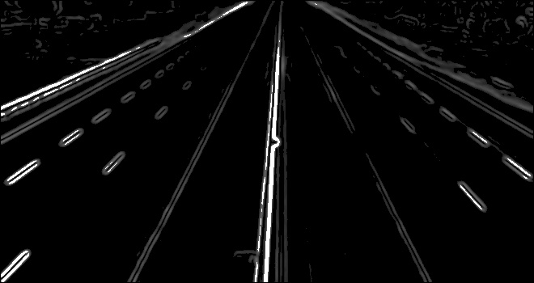
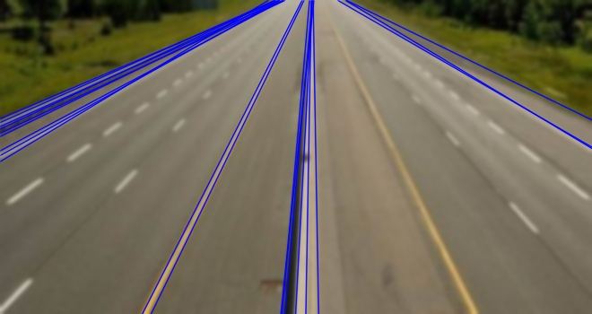

### CUDA C++ Image Processing

This CUDA C++ program performs Gaussian blur, Canny edge detection, and Hough transformation on an input image to detect and visualize lines.

#### Dependencies
- OpenCV
- CUDA Toolkit

#### Usage

1. **Clone the Repository**
   ```bash
   git clone https://github.com/your-username/your-repository.git
   cd your-repository
   ```

2. **Build the CUDA Code**
   ```bash
   nvcc -o image_processing image_processing.cu -lopencv_core -lopencv_highgui -lopencv_imgproc
   ```

3. **Run the Program**
   ```bash
   ./image_processing
   ```

#### Input
- Place your input image (`lanes.jpg`) in the project directory.

#### Output
- The processed images will be saved as `res.jpg` (Final result with detected lines).

### Example


#### Canny Edge Detection



#### Detected Lines



